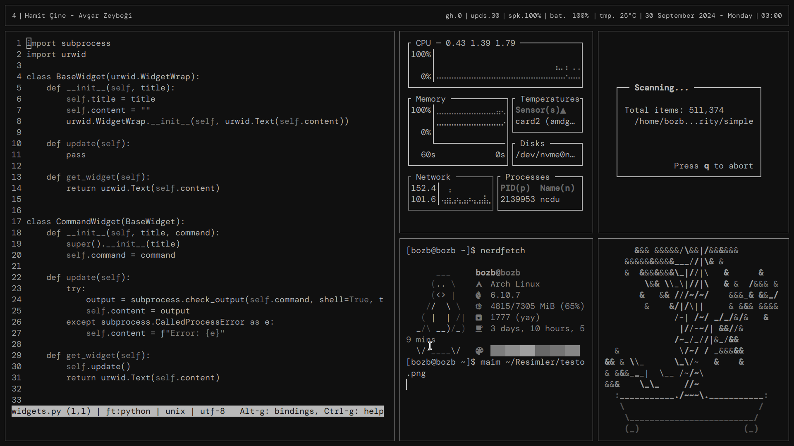

My TUI-like themed dotfiles for Arch-based Linux.

# Applications
* i3
	* There are some exec commands at the end of the config file that execute applications that I use, also configure the keyboard when i3 starts.
* picom
* alacritty
* eww
* rofi
* dunst
